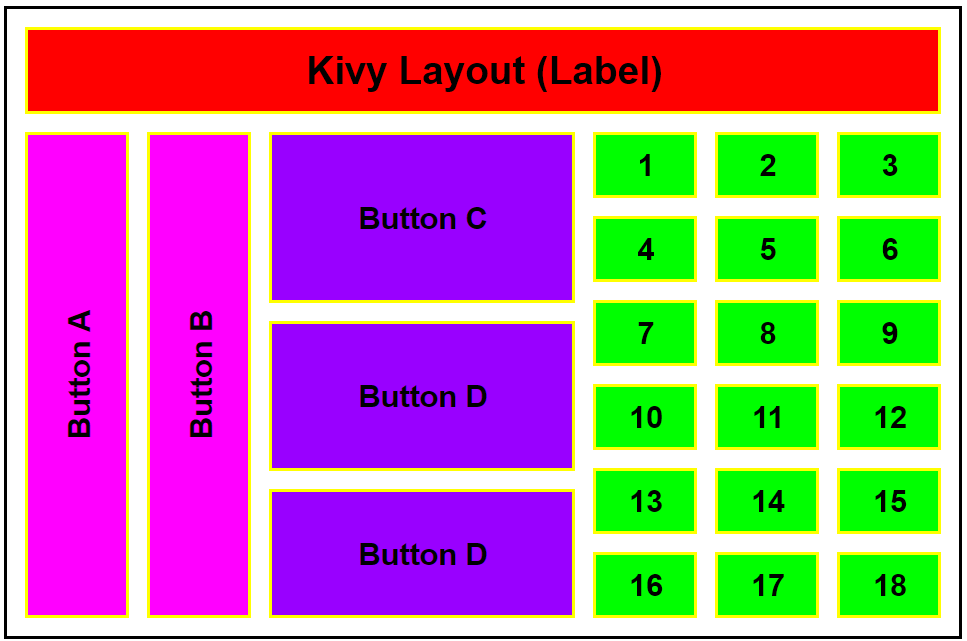

# Kivy Layout

Kivy is an open-source Python framework for developing multi-touch applications. It provides several types of layout classes to help you arrange widgets (UI elements) in your Kivy applications in a structured and organized manner. These layouts simplify the process of designing user interfaces. Here are the different types of layouts available in Kivy:

1. BoxLayout:
- BoxLayout arranges widgets in either a horizontal or vertical sequence.
- You can specify the orientation as either "horizontal" (default) or "vertical."
- Widgets are added one after another in the specified direction.
- You can also control the alignment and spacing of widgets.

2. GridLayout:
- GridLayout` organizes widgets in a grid-like fashion with rows and columns.
- You specify the number of rows and columns in the grid, and widgets are placed in cells.
- This layout is particularly useful when you want to create a grid of equally sized cells for widgets.

3. FloatLayout:
- FloatLayout allows you to position widgets by specifying their relative coordinates within the layout.
- You can use `pos_hint` to set the position as a fraction of the layout's size.
- This layout provides a high level of control over widget placement but can require manual positioning.

4. RelativeLayout:
- RelativeLayout allows you to position widgets relative to the layout or other widgets using anchors, such as "top," "bottom," "left," or "right."
- This layout is useful for creating responsive and dynamic interfaces.

5. StackLayout:
- StackLayout arranges widgets in a single row or column but does not wrap them automatically when the available space is exceeded.
- It's useful for scenarios where you want widgets to overflow in one direction without automatically wrapping to the next line or column.

6. PageLayout:
- PageLayout is designed for creating multi-page applications, such as slideshows or book-like interfaces.
- Each page can contain different widgets, and you can navigate between pages using a swipe gesture or programmatically.

7. AnchorLayout:
- AnchorLayout is a layout that positions a single child widget at one of the layout's anchor points (e.g., "top," "center," "left").
- It's useful for centering or aligning a single widget within a larger area.

Each layout type in Kivy serves a specific purpose and can be chosen based on the requirements of your user interface design. You can nest layouts within each other to create complex and responsive UIs. Additionally, Kivy provides properties and attributes to further customize the appearance and behavior of widgets within these layouts.

# Assignment
Create a Kivy GUI using buttons and labels that resembles the GUI layout below:

